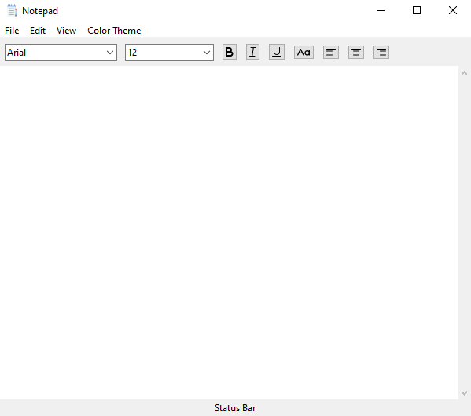

# Notepad

## Contents:
- [Description](#Description)
- [How to use](#How%20to%20use)
- [Screenshot](#Screenshot)
- [Download](#Download)

## Description:
This is a simple notepad made in python using Tkinter (GUI).

## How to use:
1. Install Python 3.8.X from [here](https://www.python.org/downloads/).
2. Install tkinter `pip install tkinter`.
3. Clone this repository: `git clone https://github.com/iam-hasibul/notepad` or click `Download ZIP` in the right panel and extract it.
4. Run `python notepad.py` from the repository's directory.

## Screenshot:

## Download:
[Download Here](https://github.com/iam-hasibul/notepad/blob/main/Notepad-1.0-win32.msi)